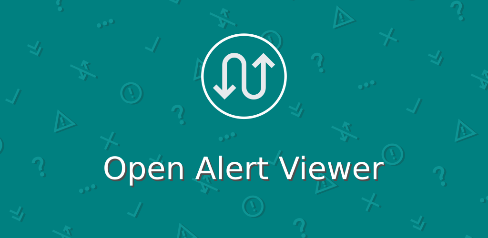
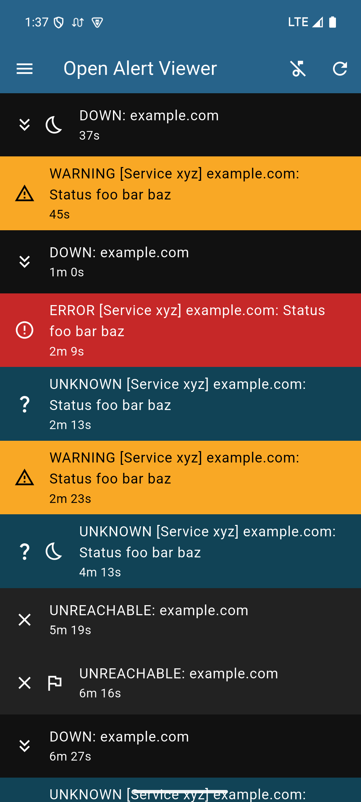
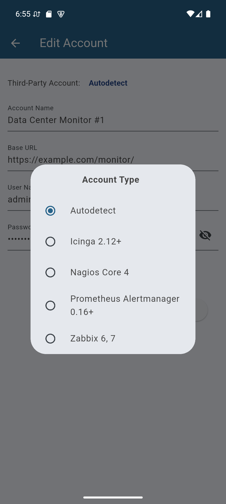
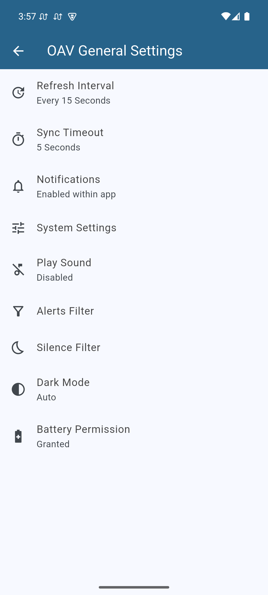
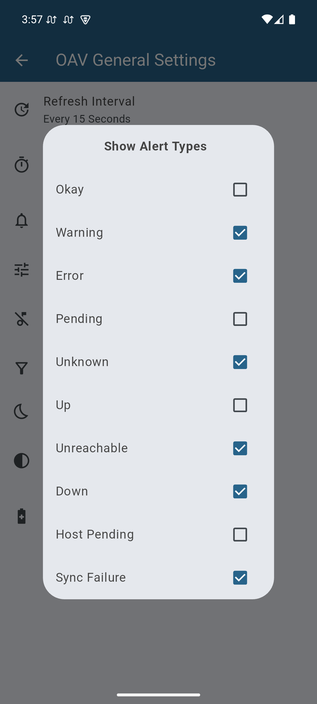

Display server and network alerts from servers running
[Prometheus](https://prometheus.io/), [Nagios](https://www.nagios.org/),
[Icinga](https://icinga.com/) or [Zabbix](https://www.zabbix.com/). For Linux
and Android.

Prometheus v0.16.0+, Nagios Core 4.x and Icinga 2.12.0+ are supported with
Basic Authentication; partial support, and default authentication for Zabbix
6.x and 7.x.

## Screenshots

    

    

    

    

## Install

## Details

The app is under the MIT / Expat license, and the dependencies are under the
MPL-2.0 and a variety of permissive / lax licenses.
([More info](https://codeberg.org/leaf-node/open_alert_viewer/blob/main/LICENSE.md))

The app also has a [privacy policy](./privacy-policy/).
